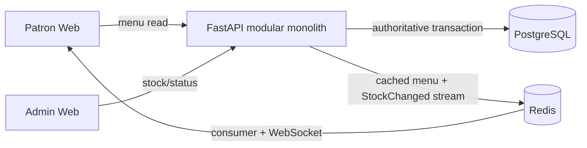
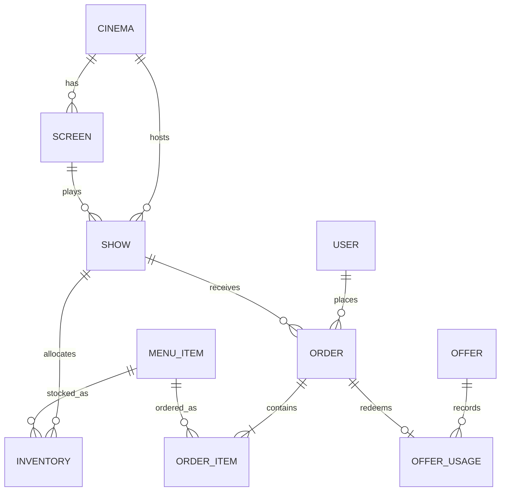

# ApexFlo Design Document

## 1. Executive summary

ApexFlo is a narrow in-seat ordering system: a QR-style patron link supplies seat context, patrons see live stock and place mock-paid orders, and staff restock/advance fulfilment. The hard guarantee is **no oversell** during synchronized intermission bursts. Tier 1 is **Offers**, not analytics: deterministic promotion decisions affect the checkout transaction; analytics is deliberately deferred from that path.

## 2. Requirements, assumptions, and scope

**Delivered:** stock-aware menu/cart/checkout; order states `PLACED → PREPARING → READY → DELIVERED`; admin stock/menu control; offer rules; stock updates; a demand simulator.

**Assumptions:** QR carries trusted-in-demo `show_id/screen_id/seat`; inventory is allocated per show; payment is mocked; a seat has one active patron session. **Critical PM questions:** is physical stock shared across shows (changes the inventory key and contention)? Are QR seat/show claims signed or only a convenience link? What p95 stock-sync SLO and reconnect behavior are acceptable? Are partial fulfilment/substitution and cancellation/restock required? What offer precedence is expected when caps, windows, and stackability conflict?

**Out of scope for currrent submission:** 
Real payments gateway integration
NO refund/Cancellation after order placed
seat-map validation, delivery routing, chain-wide analytics, and native apps.

## 3. Architecture and flows



**Synchronous:** menu cache read, checkout, offer evaluation, stock claim, order write. **Asynchronous:** Redis stock event consumption and WebSocket fan-out. A Redis or client failure must not hold a PostgreSQL checkout lock.

Checkout sorts item IDs, evaluates the offer, conditionally claims every inventory row, writes order/items/offer usage, and commits as one database transaction. A failed later line rolls back earlier claims. Admin stock adjustment commits first, then invalidates/publishes its projection event.

```text
Patron (mobile browser)
  |-- GET /api/menu/{show_id} --> Redis menu:show:{id}
  |                                | cache miss / Redis down
  |                                v
  |                          PostgreSQL: menu + inventory join
  |
  |-- POST /api/checkout (idempotency_key)
       |--> one PostgreSQL transaction (items sorted by menu_item_id)
            1. idempotency lookup        2. pure offer evaluation
            3. conditional stock UPDATE  4. order/items/usage inserts
            5. commit (or rollback every claim)
       |
       v post-commit only: Redis XADD stock-events {item, show, qty, version}
          --> consumer version-gates --> WebSocket /ws/stock/{show_id}
```

**Deliberate decision:** Redis is a fast, disposable projection; it never decides availability. Post-commit emission avoids holding database locks while waiting on Redis or slow phones.

## 4. Boundaries and data ownership

| Boundary | Owns | Decision / failure behavior |
|---|---|---|
| Inventory | `inventory(quantity, version)` | PostgreSQL conditional write is the sole stock authority; a miss is a clean 409. |
| Ordering | orders, items, idempotency, status | Transaction coordinator; retries return the original order. |
| Offers | rules and `offer_usage` | Deterministic, capped/windowed evaluation before stock locks; invalid offers cannot alter stock. |
| Projection | Redis menu/stock and events | Disposable read/fan-out state; stale client views never authorize a sale. |

These are modules, not network microservices: they have distinct consistency/failure models without premature distributed-transaction complexity.

### Data model



## 5. Correctness and 25k spike walkthrough

At a boundary/intermission, most of 25k clients are idle WebSockets or menu reads. Redis cache absorbs reads; only checkout reaches PostgreSQL. The critical statement is:

```sql
UPDATE inventory SET quantity = quantity - :qty, version = version + 1
WHERE menu_item_id=:item AND cinema_id=:cinema AND show_id=:show AND quantity >= :qty
RETURNING quantity, version;
```

Only one competing request can claim the final unit; later requests affect zero rows and receive 409. The database `CHECK(quantity >= 0)` is defense in depth. Per-show rows reduce contention versus one cinema-wide popcorn row; a hot row can still serialize, but it fails safely. Idempotency absorbs mobile retries.

Likely limits: API/DB connection pool, then a hot inventory row. Scale API/consumer processes, use a DB pooler, cap concurrency/rate-limit, and partition by show—not by weakening the predicate. Redis down: menu falls back to PostgreSQL and checkout remains correct, but live updates degrade. PostgreSQL down: reject checkout. Consumer/WebSocket down: events remain in Redis stream; clients reconcile with menu reload.

## 6. Digital twin and trade-offs

`digital_twin/simulator.py` generates configurable screens, showtimes, audience profiles, and Gaussian pre-show/intermission demand. Its faithful checkout stub models the same conditional stock claim, worker queue, and delayed stock projection. It reports queue depth, p95 latency, 409 runouts, oversells, and p95 sync lag. The default result shows popcorn allocation is the first limit, with zero oversells.

**Measured default run:** 1,740 orders; 572 accepted; 1,168 clean stock 409s; p95 checkout 39 ms; maximum queue 5; p95 stock-sync 86 ms (250 ms SLO); zero oversells. This proves stock safety and identifies popcorn allocation—not API latency—as the first constraint.

**Why this design:** Redis-only counters are fast but cannot atomically join stock, order, offer usage, and rollback; PostgreSQL can. Polling is used for the low-volume admin queue; WebSockets are used for patron stock fan-out. Analytics is intentionally not chosen: offer correctness is the higher-risk transactional pillar. At larger scale, separate the projection consumer and add durable analytics consumers, while retaining the checkout contract.

## 7. Implementation and validation

`app/services/inventory.py` contains the atomic claim; `checkout.py` coordinates the transaction; `offers.py` evaluates promotions; `routers/realtime.py` handles versioned fan-out. Run `docker compose up --build`, open `/patron?show_id=1&screen_id=1&seat=A1` and `/admin`, then run `pytest -v` and `python -m digital_twin.simulator`.
